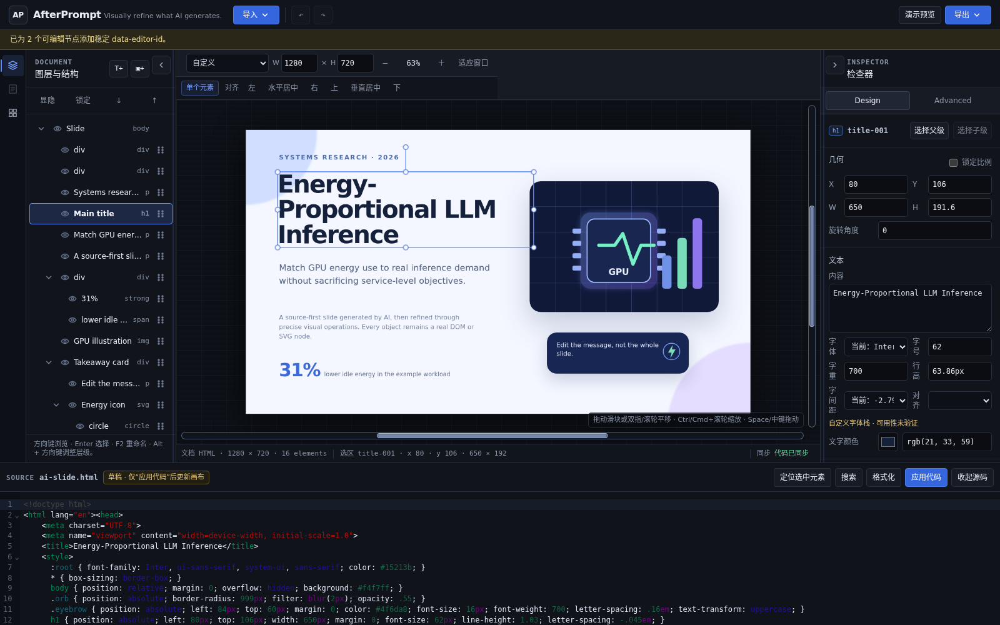

<h1 align="center">AfterPrompt</h1>

<p align="center"><strong>The source-first visual editor for AI-generated HTML, slides, and SVG.</strong></p>

<p align="center">Edit real DOM/SVG nodes, inspect readable source, and export standard files.</p>

<p align="center">
  <a href="https://redacted.invalid/last-mile-studio/"><strong>Try the live demo</strong></a> ·
  <a href="#quick-start">Run locally</a> ·
  <a href="examples/">Open an example</a> ·
  <a href="docs/ARCHITECTURE.md">Read the architecture</a>
</p>

<p align="center">
  
</p>

<p align="center"><b>English</b> · <a href="README.zh-CN.md">简体中文</a></p>

> **MVP · 0.4.0.** The `/AfterPrompt/` route is prepared for deployment; the [current live demo](https://redacted.invalid/last-mile-studio/) remains the verified entry until migration completes.

## What is AfterPrompt?

AI can generate a page, slide deck, or SVG in seconds. The final visual corrections still tend to force a choice between editing code by hand and moving the artifact into an opaque design format. AfterPrompt keeps standard HTML and SVG at the center: import the artifact, finish it visually on real document nodes, inspect the underlying source, and preview or export the result.

```text
Generate elsewhere → finish visually in AfterPrompt → keep and export standard source
```

## Product tour

1. **Bring a standard artifact.** Open HTML, SVG, a local HTML project, or a saved `.visual-project.json`; the included examples provide a safe first run.
2. **Edit the document, not a screenshot.** Select real DOM/SVG nodes, drag or resize them, adjust text and styles, manage pages and builds, and use Undo/Redo.
3. **Keep source in the loop.** Visual operations update the document model; source edits are applied explicitly and invalid drafts do not replace the last valid canvas.
4. **Leave with standard files.** Export HTML or SVG, project JSON, resource ZIPs, structural JSON, or reusable `.vfrag` packages within the documented limits.

The same document and command model also supports local JSON-command and CLI workflows. See [Command and agent workflows](docs/COMMAND_API.md).

## Quick start

Requirements: Node.js 22 or newer and npm.

```bash
npm install
npm run dev
```

Open the URL printed by Vite, normally <http://localhost:4173>. Then:

1. Choose **Import → Examples → AI slide**.
2. Select the title on the canvas and move it or change its text/style.
3. Expand the source panel to inspect the synchronized document.
4. Use **Presentation preview** or **Export → Export HTML**.

Run the repository gate before submitting changes:

```bash
npm run check
```

More paths and troubleshooting are in the [quickstart](docs/QUICKSTART.md).

## Representative workflows

- **AI-generated pages:** visually correct layout, text, images, inline SVG, and style without converting the page into a proprietary canvas format.
- **HTML slide decks:** edit statically recognizable pages, page order, canvas sizes, and cumulative `data-build` steps, then preview or export HTML.
- **SVG artwork:** edit native SVG nodes and export standard SVG.
- **Reusable fragments:** package selected nodes as versioned `.vfrag` files, inspect compatibility, and insert copies or explicitly synchronized linked instances.
- **Agent-assisted edits:** query stable IDs and apply structured commands locally without granting the editor a general command-execution channel.

## Architecture and formats

| Area | Entry point | Evidence |
|---|---|---|
| Document lifecycle | `src/core/document-model.ts` | parsing, stable IDs, commands, serialization |
| Canvas rendering | `src/canvas/renderer.ts` | sanitized HTML clone / native SVG rendering |
| Visual interactions | `src/canvas/transform-controller.ts` | Moveable adaptation and coordinate updates |
| Application UI | `src/ui/editor-app.ts` | import, panels, preview, export |
| CLI | `src/cli/index.ts` | local query, command, export, fragment workflows |
| Visual Fragments | `src/core/fragments/` | packages, schema, ingest, instances |

Read [Architecture](docs/ARCHITECTURE.md), [Visual Fragment format](docs/VISUAL_FRAGMENTS.md), and the public [manifest schema](schemas/visual-fragment-manifest.schema.json).

## Safety model

Imported content is treated as a static visual document in the editing surface. The canvas renders a sanitized clone and does not execute imported scripts. Dangerous elements, event attributes, and URL forms are filtered by the current sanitizer; external or missing resources are surfaced rather than silently fetched by fragment import.

This is **not** a universal hostile-content sandbox or a supported anonymous multi-tenant isolation boundary. Exported HTML can retain source runtime behavior, so review exported documents before opening or publishing them. Read the complete [security boundaries](docs/SECURITY.md) and [reporting policy](SECURITY.md).

## Current limitations

AfterPrompt does not claim arbitrary-webpage compatibility or byte-identical round trips. DOM parsing can normalize markup; complex stylesheet rules are not rewritten in place; advanced SVG filters, animation, external runtimes, group scaling/rotation, cloud collaboration, accounts, and automatic cross-project fragment updates remain outside the reliable current scope. See [documented limits](docs/SECURITY.md#security-and-compatibility-limits).

## Development

```bash
npm run test       # unit and contract tests
npm run build      # typecheck + Vite build
npm run check      # aggregate project gate
npm run cli -- --help
```

Real-browser and specialized checks are available in `package.json`, including `test:browser`, `test:layout-parity`, `test:viewport-invariance`, and `test:production`. Browser checks require a local Chrome/Chromium installation.

See [Contributing](CONTRIBUTING.md), the [changelog](CHANGELOG.md), and the [deployment guide](docs/DEPLOYMENT.md).

## License and notices

AfterPrompt's existing license terms are in [LICENSE](LICENSE). Third-party packages and bundled font assets keep their own terms; see [THIRD_PARTY_NOTICES.md](THIRD_PARTY_NOTICES.md), [NOTICE](NOTICE), [RELICENSING.md](RELICENSING.md), and [TRADEMARKS.md](TRADEMARKS.md). This launch preparation does not select or change the project license.
