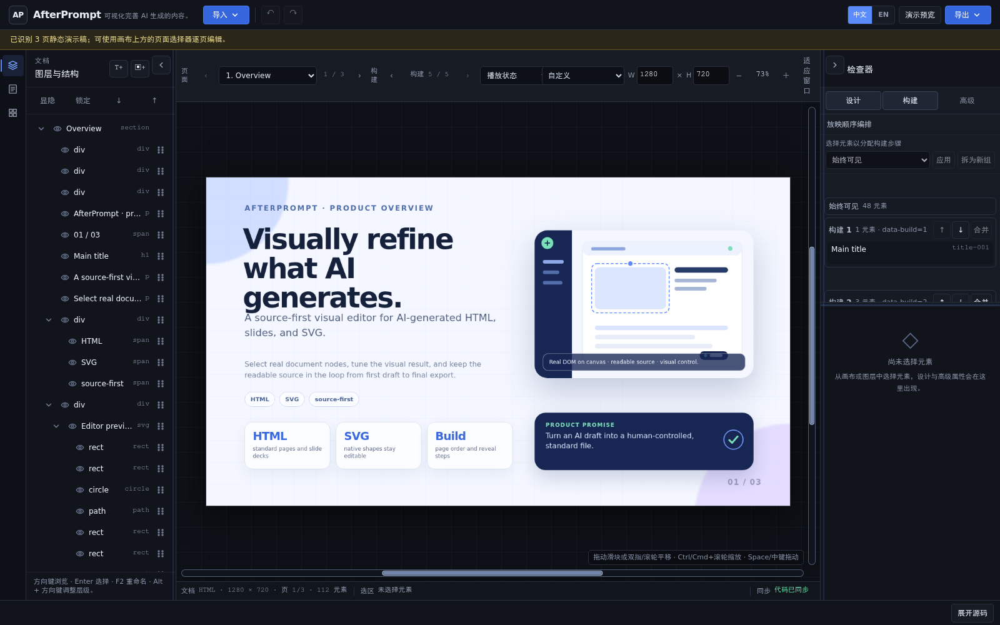

<h1 align="center">AfterPrompt</h1>

<p align="center"><strong>面向 AI 生成 HTML、幻灯片和 SVG 的源码优先可视化编辑器。</strong></p>

<p align="center">直接编辑真实 DOM/SVG 节点，查看可读源码，并导出标准文件。</p>

<p align="center">
  <a href="https://ytdou.github.io/AfterPrompt/"><strong>在线体验</strong></a> ·
  <a href="#快速开始">本地运行</a> ·
  <a href="examples/">查看示例</a> ·
  <a href="docs/ARCHITECTURE.md">阅读架构文档</a>
</p>

<p align="center">
  
</p>

<p align="center"><a href="README.md">English</a> · <b>简体中文</b></p>

> **MVP · 0.4.0。** 核心编辑、源码、导出、CLI 和 Visual Fragment 工作流已可用；当前限制见下文。

## AfterPrompt 是什么？

AI 可以快速生成页面、幻灯片或 SVG，但最后的视觉微调往往需要手写代码，或将内容转入不透明的设计格式。AfterPrompt 以标准 HTML 和 SVG 为中心：导入现有内容，在真实文档节点上完成可视化修改，查看底层源码，并导出标准文件。

```text
在其他工具中生成 → 在 AfterPrompt 中可视化完善 → 保留并导出标准源码
```

## 产品流程

1. **导入标准内容。** 打开 HTML、SVG、本地 HTML 项目或 `.visual-project.json`；内置示例可用于快速体验。
2. **编辑文档而非截图。** 选择真实 DOM/SVG 节点，拖动、缩放、调整文字与样式，并管理页面和 Build。
3. **保持源码可见。** 可视化操作会更新文档模型；源码草稿只有在显式应用后才会替换当前有效画布。
4. **导出标准文件。** 导出 HTML、SVG、项目 JSON、资源 ZIP、结构 JSON 或可复用 `.vfrag` 包。
5. **使用中文或英文界面。** 编辑器加载时会遵循浏览器语言（中文浏览器语言使用中文，其他语言使用英文）。可用右上角的**中文 / EN**切换完整编辑器界面；导入的文档内容不会被翻译。

同一文档与命令模型也支持本地 JSON 命令和 CLI 工作流，详见[命令与 Agent 工作流](docs/COMMAND_API.md)。

## 快速开始

需要 Node.js 22 或更高版本及 npm。

```bash
npm install
npm run dev
```

打开 Vite 输出的地址，通常是 <http://localhost:4173>，然后：

1. 选择**导入 → 示例 → AI slide**。
2. 选中画布中的标题，移动它或修改文字/样式。
3. 展开源码面板，查看同步后的文档。
4. 使用**演示预览**或**导出 → 导出 HTML**。

提交修改前运行：

```bash
npm run check
```

更多路径与排错信息见[快速开始文档](docs/QUICKSTART.md)。

## 典型工作流

- **AI 生成页面：** 修正布局、文字、图片、内嵌 SVG 和样式，无需转换为专有画布格式。
- **HTML 幻灯片：** 编辑可静态识别的页面、顺序、画布尺寸和 `data-build` 步骤，然后预览或导出 HTML。
- **SVG 图形：** 编辑原生 SVG 节点并导出标准 SVG。
- **可复用片段：** 将选中节点打包为带版本的 `.vfrag`，检查兼容性，并插入独立副本或显式同步的关联实例。
- **Agent 辅助编辑：** 使用稳定 ID 查询和应用结构化命令，不向编辑器开放通用命令执行通道。

## 架构与格式

| 领域 | 入口 | 用途 |
|---|---|---|
| 文档生命周期 | `src/core/document-model.ts` | 解析、稳定 ID、命令与序列化 |
| 画布渲染 | `src/canvas/renderer.ts` | 净化的 HTML 副本与原生 SVG 渲染 |
| 可视化交互 | `src/canvas/transform-controller.ts` | 拖动、缩放和坐标更新 |
| 应用界面 | `src/ui/editor-app.ts` | 导入、面板、预览与导出 |
| CLI | `src/cli/index.ts` | 本地查询、命令、导出和片段工作流 |
| Visual Fragments | `src/core/fragments/` | 包、Schema、导入与实例 |

详见[架构](docs/ARCHITECTURE.md)、[Visual Fragment 格式](docs/VISUAL_FRAGMENTS.md)和公开的 [Manifest Schema](schemas/visual-fragment-manifest.schema.json)。

## 安全模型

导入内容在编辑界面中被视为静态视觉文档。画布渲染经过净化的副本，不执行导入脚本；当前净化器会过滤危险元素、事件属性和 URL 形式。

这不是通用的恶意内容沙箱，也不是支持匿名多租户的隔离边界。导出的 HTML 可能保留源文档运行时行为，打开或发布前应先审查。详见[安全边界](docs/SECURITY.md)和[漏洞报告政策](SECURITY.md)。

## 当前限制

AfterPrompt 不声称兼容任意网页，也不保证逐字节往返一致。DOM 解析可能规范化标记；复杂样式表规则不会被就地重写；高级 SVG 滤镜、动画、外部运行时、组缩放/旋转、云协作、账号以及跨项目自动片段更新不在当前可靠范围内。详见[已记录的限制](docs/SECURITY.md#security-and-compatibility-limits)。

## 开发

```bash
npm run test       # 单元和契约测试
npm run build      # 类型检查 + Vite 构建
npm run check      # 聚合项目检查
npm run cli -- --help
```

`package.json` 中还包含 `test:browser`、`test:layout-parity` 和 `test:viewport-invariance` 等专用检查。浏览器检查需要本地 Chrome/Chromium。

详见[贡献指南](CONTRIBUTING.md)和[变更日志](CHANGELOG.md)。

## 许可证与声明

AfterPrompt 采用 [Apache License 2.0](LICENSE)。第三方软件包和内置字体资产保留各自的许可条款；详见 [THIRD_PARTY_NOTICES.md](THIRD_PARTY_NOTICES.md)、[NOTICE](NOTICE)、[RELICENSING.md](RELICENSING.md) 和 [TRADEMARKS.md](TRADEMARKS.md)。
