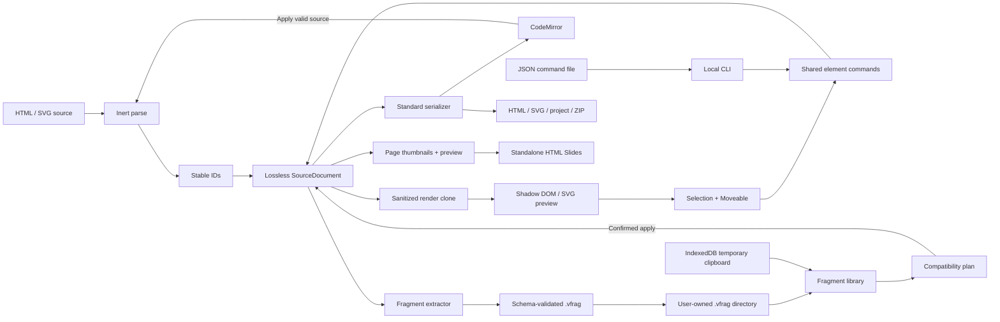

# Architecture

## 目标与边界

Last Mile Studio 的核心不是“做一个更大的网页生成器”，而是验证一条可靠的局部编辑链路：

1. AI 生成的 HTML / SVG 仍然是第一等源文件；
2. 用户直接操作真实节点；
3. 每次操作可以用稳定 ID 描述；
4. 标准源文件、浏览器画布和 Codex 命令之间没有隐藏的唯一真相；
5. 导入的不可信静态内容不能执行脚本或本地命令。

本阶段支持静态 HTML 演示稿的页面级管理，但不建立脱离源 DOM 的私有 Slide 模型，也不建立账号、云存储、多人协作或像素编辑能力。

## 数据流



## 真相来源

编辑会话中的规范状态是 `SourceDocument.document`：浏览器原生 `Document` 中的真实 HTML / SVG 节点。预览是该文档的安全克隆，代码视图是规范文档的序列化结果。

视觉手势期间，为避免每个像素都进入历史，变换同时写入预览节点和规范节点，但只在手势结束时：

1. 序列化规范节点；
2. 创建一个历史快照；
3. 刷新代码视图；
4. 从规范节点重建安全预览。

离散操作（文本、颜色、删除、重排等）直接走同一个命令层，然后立即提交一次历史。

## 模块职责

| 模块 | 责任 | 不负责 |
|---|---|---|
| `SourceDocument` | 解析、文档类型、画布尺寸、序列化、命令入口、结构摘要 | UI、鼠标事件 |
| `ids.ts` | 可编辑节点识别、稳定 ID、复制节点的新 ID | CSS selector 路径作为身份 |
| `sanitizer.ts` | 删除可执行节点、事件属性和危险协议 | 多租户级浏览器沙箱 |
| `commands.ts` | 基于 ID 的局部节点修改、统一命令、摘要 | 文件 I/O、历史策略 |
| `CanvasRenderer` | 安全预览、资源映射、选择与直接文字编辑 | 规范状态所有权 |
| `TransformController` | Moveable 事件到共享变换函数 | 文档序列化 |
| `History` | 快照 Undo / Redo、连续操作合并 | 判断业务命令合法性 |
| `ProjectAssets` | 内存资源、Blob URL、项目 JSON、ZIP | 云存储 |
| `presentation.ts` | 内嵌本地资源、生成隔离预览与独立 HTML Slides | 成为新的文档真相、执行导入脚本 |
| `fragments/extract.ts` | 选区、局部坐标、匹配样式、资源、SVG defs 和预览 | 修改当前文档 |
| `fragments/package.ts` / `schema.ts` | `.vfrag` ZIP、JSON Schema、安全限额与往返 | 决定 UI 插入位置 |
| `fragments/import.ts` | 兼容性报告、ID/引用/资源映射与确认后写入 | 静默忽略冲突 |
| `fragments/component.ts` | 属性、插槽、关联状态和显式实例同步 | 建立第二套组件树 |
| `fragments/library.ts` | 用户目录 provider、IndexedDB 临时剪贴板、内存降级及非破坏迁移 | 云端市场或页面实例真相 |
| `fragments/ingest.ts` | 原始 SVG/PNG/JPEG 规范化为 `.vfrag` | OCR、自动分层或矢量化 |
| `SourceCodeEditor` | 代码草稿、搜索、元素定位 | 自动接受无效源码 |
| CLI | 文件读取、命令批处理、安全写出 | 浏览器精确布局 |

## 稳定 ID

可编辑节点使用 `data-editor-id`：

```html
<h1 data-editor-id="title-001">Title</h1>
```

规则：

- 保留唯一的已有 `data-editor-id`；
- 优先从已有 `id` 派生；
- 否则按标签和文档顺序生成确定性编号；
- 复制节点会为整棵子树生成新的 ID；
- 查询实现比较属性值，不把未验证 ID 拼进 CSS selector。

生成方式是确定性的，但首次导入时新增 ID 必然修改源文件。之后 Codex 和视觉编辑都以这些 ID 为定位契约。

## HTML 与 SVG 统一抽象

统一层只约束：身份、父子关系、可见性、锁定、文本、样式、变换和边界。真实节点类型仍然保留：

- HTML 尺寸优先写入 `style.width` / `style.height`；
- HTML 移动默认写入组合 transform，避免暗中破坏 Flex / Grid；
- SVG `rect` / `image` / `circle` / `ellipse` 优先更新几何属性；
- 通用 SVG 节点移动、旋转与缩放使用保留原 transform 的组合变换；
- 不执行导入演示稿脚本；对于 `deck-stage > section` 等多页结构，由编辑器静态接管可见页和页面切换，避免自定义元素失效后整稿隐藏；
- 不把 SVG path 转换成 Canvas path，也不扁平化 `g`。

## 历史模型

历史项是包含 source、document type、canvas、source name、selection 和项目资源引用集合的快照。资源字节在未修改时共享底层 `Uint8Array`；片段插入的 Undo 会恢复插入前资源集合。快照比逐命令反演更适合 MVP，因为：

- HTML 与 SVG 操作可以共享恢复逻辑；
- 删除、复制、重排和代码整体应用都可可靠恢复；
- 手势只在结束时提交，不产生像素级历史洪水。

代价是大文档的内存开销；后续可把内部实现替换为 source-location patch，而不改变 UI 命令接口。

页面切换本身不创建历史项，但会更新当前历史快照的 `activePageId` 上下文。因此在某页执行复制、删除或排序后，Undo / Redo 会恢复对应页面，而不会跳到同一索引上的另一页。

## 演示文稿模型

多页内容仍然是规范 HTML 中的真实兄弟节点。`SourceDocument` 负责识别页面并执行复制、删除和重排；复制页面时整棵子树重新分配稳定 ID。胶片栏缩略图使用只包含活动页祖先链的安全 DOM 克隆，避免 N 页演示稿产生 N×N 个预览页面节点。

规范文档保留完整 HTML，包括惰性的脚本和事件属性。画布与演示预览从它创建净化副本：实际预览页面位于 `sandbox="allow-same-origin"` 且不允许源脚本的内层 iframe，外层只运行固定导航逻辑。“导出 HTML”走另一条保真序列化路径，内嵌本地资源但不删除或替换源运行时，也不生成 LMS 播放外壳。

页面盒模型由 `presentation-layout.ts` 集中定义，编辑器安全预览和内部播放器复用相同的绝对定位、尺寸、box-sizing 与 active/inactive 规则。布局始终在文档声明的设计画布中完成，编辑器 zoom 和网页 viewport 只作用于最外层 transform。

需要确定性排版的文档通过根节点 `data-lms-deterministic-font="inter"` 显式加入字体策略。`typography.ts` 在编辑器主 document 注册同一 WOFF2，在 Shadow DOM 中选择同一 family，并在导出文件中保留自包含 `@font-face`。编辑器会等待 `document.fonts.ready` 后重新渲染和测量。

`layout-audit.ts` 提供按稳定 ID 的布局快照与差异比较。浏览器 gate 对字体属性、文本行数、client/scroll 尺寸和去缩放几何进行比较；行数必须完全一致，几何默认允许 0.5 px 抗锯齿舍入误差。

## 代码同步与错误恢复

视觉操作后的代码是规范文档序列化结果。代码编辑是一个显式草稿分支：

- 输入时仅标记“未应用”；
- 点击“应用代码”后解析和净化；
- 成功才替换 `SourceDocument` 并进入历史；
- 失败只显示错误，原模型、画布和有效源码不变。

这个边界避免半解析 DOM 和代码草稿长期分叉。

## 资源模型

目录导入后，每个资源保存为 `{ path, mimeType, bytes }`。预览时：

- 相对图片 URL 映射为临时 Blob URL；
- 本地外部 CSS 读入 Shadow DOM，并把其中的相对 URL 映射为 Blob URL；
- 规范源文件仍保留原相对路径；
- ZIP 导出恢复入口路径和所有资源；
- 项目 JSON 用 base64 保存资源，标准 HTML / SVG 仍可单独导出。

项目 JSON 还保存最近 500 条操作日志。日志是审计线索，不是恢复真相；Undo / Redo 仍只依赖当前会话的历史快照。

## Visual Fragment 模型

Visual Fragment 定义是规范 DOM/SVG 选区的可移植派生包。包内 `data-vfrag-node-key` 是定义内部的稳定绑定键；导入时普通 ID 和 `data-editor-id` 可以重映射，但 node key 不变，因此组件属性和插槽不依赖目标项目身份。

导入严格分为只读 `planVisualFragmentInsert()` 和有副作用 `applyVisualFragmentInsertPlan()`。兼容性报告、全部 ID/资源映射和最终源码在 plan 阶段确定；用户确认后才把节点、版本隔离样式和资源写入当前项目。关联信息使用可读 `data-vfrag-*` 属性保存在规范节点上，本地库只保存定义和版本，不拥有页面实例状态。

完整协议见 [VISUAL_FRAGMENTS.md](VISUAL_FRAGMENTS.md)。

`.vfrag` 1.0 保存 HTML/SVG 结构；1.1 保存单个 PNG/JPEG Raster element。Raster 字节在插入时进入 `ProjectAssets`，HTML 物化为 ``，SVG 物化为 `<image>`。预览中的相对路径可以映射为 Blob URL，但规范源码仍保存可导出的项目资源路径。

本地片段目录中的 `.vfrag` 是库的长期事实源。IndexedDB 只承担由 `Ctrl/Cmd+C` 写入、由 `Ctrl/Cmd+V` 读取的短期临时片段剪贴板和旧记录迁移；未连接目录时，持久保存默认下载 `.vfrag`，保存 UI 不提供 IndexedDB 目标。目录内容索引可由包 manifest 重建，可选 sidecar 只保存收藏和使用次数。页面实例仍完全物化在 `SourceDocument` 中，不依赖目录文件持续存在。本阶段没有账号、云端存储或同步 adapter。

## 可扩展点

- `EditorCommand` 可直接复用于 HTTP API、MCP 或桌面宿主；
- `SourceDocument` 可扩展多页容器，而不改变单页节点命令；
- `CanvasRenderer` 可以为 iframe 隔离或 CSP worker parser 提供第二实现；
- `History` 可以替换为增量 patch；
- `ElementChanges` 可以增加 Flex / Grid、SVG path 点编辑和组件语义。
- Fragment library 可以换成本地文件或远端 registry 适配器，但 package/schema/plan/apply 边界保持不变。
